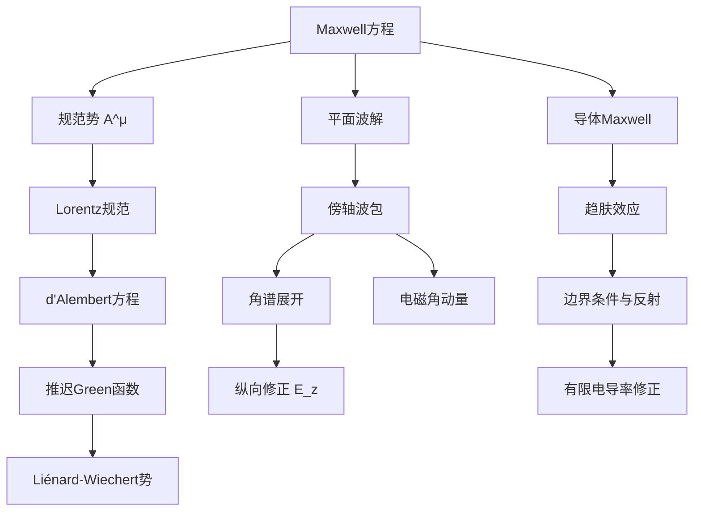

---
tags:
  - 电动力学
  - 知识点
  - 物理
date: 2026-04-30
up:
  - "[[工具箱]]"
---

# 电动力学知识点

> 整理自 [[Yau 电动力学]] 丘成桐考题（2023–2025），覆盖 Maxwell 方程、规范势、电磁波、导体、辐射等核心模块。

---

## 一、Maxwell 方程组

### 1.1 基本方程

在 **Heaviside-Lorentz 单位制** 下：

$$
\nabla\cdot\mathbf{E} = \rho,\quad \nabla\cdot\mathbf{B} = 0
$$
$$
\nabla\times\mathbf{E} = -\frac{1}{c}\frac{\partial\mathbf{B}}{\partial t},\quad \nabla\times\mathbf{B} = \frac{1}{c}\mathbf{J} + \frac{1}{c}\frac{\partial\mathbf{E}}{\partial t}
$$

在 **SI 单位制** 下：

$$
\nabla\cdot\mathbf{D} = \rho_f,\quad \nabla\cdot\mathbf{B} = 0
$$
$$
\nabla\times\mathbf{E} = -\frac{\partial\mathbf{B}}{\partial t},\quad \nabla\times\mathbf{H} = \mathbf{J}_f + \frac{\partial\mathbf{D}}{\partial t}
$$

### 1.2 方程的结构分类

| 类型                | 方程                                                                                                              | 身份    |
| ----------------- | --------------------------------------------------------------------------------------------------------------- | ----- |
| **含源方程**          | $\nabla\cdot\mathbf{E}=\rho$，$\nabla\times\mathbf{B} = \frac{1}{c}\mathbf{J} + \frac{1}{c}\partial_t\mathbf{E}$ | 动力学方程 |
| **无源方程（Bianchi）** | $\nabla\cdot\mathbf{B}=0$，$\nabla\times\mathbf{E}+\frac{1}{c}\partial_t\mathbf{B}=0$                            | 几何恒等式 |

> 🔑 Bianchi 方程在引入势 $A^\mu$ 后**自动满足**。

---

## 二、规范势与规范变换

### 2.1 势的定义

$$
\mathbf{E} = -\nabla\phi - \frac{1}{c}\frac{\partial\mathbf{A}}{\partial t},\qquad \mathbf{B} = \nabla\times\mathbf{A}
$$

### 2.2 规范变换

$$
\phi \to \phi + \frac{1}{c}\frac{\partial f}{\partial t},\qquad \mathbf{A} \to \mathbf{A} - \nabla f
$$

- $\mathbf{E}$ 和 $\mathbf{B}$ 在规范变换下**严格不变**
- 原因：$\nabla(\partial_t f) - \partial_t(\nabla f) = 0$，$\nabla\times(\nabla f)=0$

### 2.3 Lorentz 规范

$$
\frac{1}{c}\partial_t\phi + \nabla\cdot\mathbf{A} = 0\quad\Longleftrightarrow\quad \partial_\mu A^\mu = 0
$$

- **作用**：将 $\phi$ 和 $\mathbf{A}$ 的方程**去耦合**（decouple）
- 在 Lorentz 规范下，势满足 **d'Alembert 方程**：

$$
\square\phi = -\rho,\qquad \square\mathbf{A} = -\frac{1}{c}\mathbf{J}
$$

其中 $\square \equiv \frac{1}{c^2}\partial_t^2 - \nabla^2$ 

---

## 三、Green 函数与推迟势

### 3.1 推迟 Green 函数

d'Alembert 算符的 Green 函数：

$$
\square G(t,\mathbf{r}) = \delta(t)\delta^3(\mathbf{r})
$$

解为 **推迟 Green 函数**：

$$
G(t-t_0, \mathbf{r}-\mathbf{r}_0) = \frac{\theta(t-t_0)}{4\pi|\mathbf{r}-\mathbf{r}_0|}\,
\delta\!\left(t - t_0 - \frac{|\mathbf{r}-\mathbf{r}_0|}{c}\right)
$$

- $\theta(t-t_0)$：因果性 → 只在推迟时间有贡献
- $\delta(t-t_0-|\mathbf{r}-\mathbf{r}_0|/c)$：支撑在**光锥**上
- 分母 $4\pi R$：来自三维空间的 Coulomb 势

### 3.2 推迟势的通解

$$
\phi(\mathbf{r},t) = \int d^3r'\,dt'\,G(t-t',\mathbf{r}-\mathbf{r}')\,\rho(\mathbf{r}',t')
$$

$$
\mathbf{A}(\mathbf{r},t) = \frac{1}{c}\int d^3r'\,dt'\,G(t-t',\mathbf{r}-\mathbf{r}')\,\mathbf{J}(\mathbf{r}',t')
$$

### 3.3 Liénard-Wiechert 势（非相对论极限）

运动点电荷 $e$，轨迹 $\mathbf{R}(t)$，速度 $\mathbf{v}(t)=\dot{\mathbf{R}}(t)$。

**非相对论 + 远场近似条件**：
- $|\mathbf{R}|\ll |\mathbf{r}|$（远场）
- $|\mathbf{v}|\ll c$（非相对论）
- $|\mathbf{R}|\ll ct$ 

展开到 $\mathcal{O}(1/r)$ 和 $\mathcal{O}(v/c)$：

$$
\phi(\mathbf{r},t) \approx \frac{e}{4\pi r}\Big|_{t_{\rm ret}},\qquad
\mathbf{A}(\mathbf{r},t) \approx \frac{e\mathbf{v}}{4\pi c r}\Big|_{t_{\rm ret}}
$$

其中 **推迟时刻**：$t_{\rm ret} = t - \frac{|\mathbf{r}|}{c}$ 

### 3.4 物理意义

- 场的"消息"以光速传播 → 观察者看到的是源在**过去**的状态
- 这是**狭义相对论因果律**在电动力学中的直接体现

---

## 四、电磁波

### 4.1 真空中的平面波

**色散关系**：$\omega = ck$ 

**基本解**（沿 $z$ 方向传播）：

$$
\mathbf{E} = \mathbf{E}_0 e^{i(kz-\omega t)},\quad \mathbf{B} = \hat{\mathbf{z}}\times\mathbf{E}
$$

> $\mathbf{E}\perp\mathbf{B}\perp\hat{\mathbf{z}}$，电磁波是**横波**。

### 4.2 偏振

**线偏振**：$\mathbf{E}_0$ 为实矢量

**圆偏振**：
$$
\mathbf{E}_0 \propto \frac{\hat{\mathbf{x}} \pm i\hat{\mathbf{y}}}{\sqrt{2}}
$$

- $+$：左旋圆偏振（LCP），光子自旋 $+\hbar$ 
- $-$：右旋圆偏振（RCP），光子自旋 $-\hbar$ 

### 4.3 能量密度与 Poynting 矢量

**时间平均能量密度**（复表示）：

$$
\langle u \rangle = \frac{1}{4}\operatorname{Re}\!\left(\mathbf{E}\cdot\mathbf{E}^* + \mathbf{B}\cdot\mathbf{B}^*\right)
$$

**Poynting 矢量**：$\mathbf{S} = c\,\mathbf{E}\times\mathbf{B}$（HL 单位制）

### 4.4 电磁角动量

**角动量密度**：$\mathbf{l} = \mathbf{r}\times\mathbf{g}$，其中动量密度 $\mathbf{g} = \mathbf{S}/c^2$

**自旋角动量与轨道角动量**：
- 圆偏振光携带**自旋角动量**（SAM）：每光子 $\pm\hbar$
- 波包的空间结构可携带**轨道角动量**（OAM）

**比值**：
$$
\frac{\langle L^z\rangle}{\langle U\rangle} = \frac{\pm 1}{\omega} \quad\longleftrightarrow\quad \frac{\pm\hbar}{\hbar\omega}
$$

> 这是经典电磁场与**光子图像**之间的桥梁。

### 4.5 复表示的物理意义 ⭐

#### 4.5.1 约定与出发点

**核心约定**：物理场 = 复表示的**实部**。

$$
\mathbf{E}_{\rm phys}(\mathbf{r},t) = \operatorname{Re}\!\big[\mathbf{E}_c(\mathbf{r})\,e^{-i\omega t}\big]
$$

> 有些文献用 $e^{+i\omega t}$，只需保持一致即可。本文用 $e^{-i\omega t}$（量子力学惯例）。

**为什么用复数？**
1. Maxwell 方程是**线性**的 → 复线性叠加后取实部等价于先取实部再叠加
2. 对时谐场（单频 $\omega$），$\partial_t \to -i\omega$ 将微分方程**代数化**
3. 复振幅的**模** $|\mathbf{E}_c|$ = 振幅，**辐角** $\arg(\mathbf{E}_c)$ = 相位

#### 4.5.2 实数 vs 虚数：波数 $k$ 的判决性角色

真空中 Maxwell 方程代入 $e^{i(kz-\omega t)}$ 给出色散关系：

$$
k^2 = \frac{\omega^2}{c^2}
$$

数学上 $k$ 有两个解：$k = \pm \omega/c$。但推广到有耗散/有约束的介质时，$k$ 可以是**复数**：

$$
k = k' + i k''
$$

| $k$ 的类型 | 场的形式 $e^{i(kz-\omega t)}$ | 物理图像 |
|:---|:---|:---|
| **$k$ 为纯实数** ($k''=0$) | $e^{i(k'z-\omega t)}$ | **传播波**：等相位面前进，振幅不衰减 |
| **$k$ 为纯虚数** ($k'=0$) | $e^{-k''z}\,e^{-i\omega t}$ | **衰逝波**（evanescent）：振幅指数衰减，**不传播能量** |
| **$k$ 为一般复数** | $e^{-k''z}\,e^{i(k'z-\omega t)}$ | **衰减传播**：既有传播又有衰减（导体、损耗介质） |

> 🔑 关键判据：$\operatorname{Re}(k)$ 决定**传播**，$\operatorname{Im}(k)$ 决定**衰减/放大**。$k''>0$ 对应衰减（因果性要求介质中 $k''\ge 0$）。

#### 4.5.3 复波数与趋肤深度的联系

在良导体中（见 §六），波数严格为复数：

$$
k_c = \frac{1+i}{\delta},\qquad \delta = \sqrt{\frac{2}{\sigma\mu\omega}}
$$

- $\operatorname{Re}(k_c) = 1/\delta$：传播 → 波长 $2\pi\delta$
- $\operatorname{Im}(k_c) = 1/\delta$：衰减 → 每前进 $\delta$，振幅降为 $1/e$

> 趋肤深度 $\delta$ 是 $\operatorname{Re}(k)=\operatorname{Im}(k)$ 时自然出现的长度尺度。

#### 4.5.4 复 Poynting 矢量 —— 实部做功，虚部储能

定义**复 Poynting 矢量**（时谐场）：

$$
\mathbf{S}_c = \frac{1}{2}\,\mathbf{E}_c \times \mathbf{H}_c^*
$$

其物理意义（对时间平均）：

| 部分 | 公式 | 物理意义 |
|:---|:---|:---|
| **实部** $\operatorname{Re}(\mathbf{S}_c)$ | $\langle\mathbf{S}\rangle_t$ | **时间平均能流** = 真正"流走"的功率 |
| **虚部** $\operatorname{Im}(\mathbf{S}_c)$ | — | **无功功率** = 原地振荡、不传输能量的储能 |

> 💡 类比交流电路：复功率 $\tilde{S} = VI^*$，实部 = 有功功率（发热），虚部 = 无功功率（电感/电容储能振荡）。

复 Poynting 定理（时谐形式）：

$$
\nabla\cdot\mathbf{S}_c = -\frac{1}{2}\mathbf{J}_c^*\cdot\mathbf{E}_c + 2i\omega\,(u_e - u_m)
$$

- 实部：Ohm 损耗 + 辐射出去的能量
- 虚部：电场储能与磁场储能的**差值** $u_e-u_m$ 的 $2\omega$ 倍

#### 4.5.5 复介电常数 —— 实部储能，虚部损耗

将传导电流 $\mathbf{J}=\sigma\mathbf{E}$ 吸收进介电常数：

$$
\epsilon_c(\omega) = \epsilon'(\omega) + i\epsilon''(\omega)
$$

| 部分 | 物理意义 |
|:---|:---|
| $\epsilon'(\omega) = \operatorname{Re}(\epsilon_c)$ | **储能**（极化响应），决定折射率 $n\approx\sqrt{\epsilon'}$ |
| $\epsilon''(\omega) = \operatorname{Im}(\epsilon_c)$ | **损耗**（$\epsilon''>0$ 对应能量耗散） |

对良导体极限 $\sigma\gg\omega\epsilon$：

$$
\epsilon_c \approx \epsilon + i\frac{\sigma}{\omega}
$$

> 虚部 $\propto\sigma/\omega$：电导率越大 → 损耗越大 → 波越快衰减。

#### 4.5.6 小结：实虚对照表

| 量 | 实部含义 | 虚部含义 |
|:---|:---|:---|
| **复振幅** $\mathbf{E}_c$ | 实际物理场 $=\operatorname{Re}(\mathbf{E}_c e^{-i\omega t})$ | 相位信息（超前/滞后），携带偏振旋向 |
| **波数** $k = k'+ik''$ | $k'$ 决定传播（波长 $\lambda=2\pi/k'$） | $k''$ 决定衰减（趋肤深度 $\delta=1/k''$） |
| **复 Poynting 矢量** $\mathbf{S}_c$ | 时间平均能流（有功功率） | 无功功率（振荡储能） |
| **复介电常数** $\epsilon_c$ | 极化储能（决定折射率） | 介电损耗（能量 → 热） |
| **偏振矢量** $\hat{\mathbf{x}}\pm i\hat{\mathbf{y}}$ | $x$ 分量 | $y$ 分量 $\pm90^\circ$ 相位差 → 圆偏振旋向 |

#### 4.5.7 时间平均定理 —— 连接复数与可观测量

这是复数表示中**最实用的定理**。对两个同频谐变场：

$$
A(t) = \operatorname{Re}\!\big[A_c\,e^{-i\omega t}\big],\qquad
B(t) = \operatorname{Re}\!\big[B_c\,e^{-i\omega t}\big]
$$

其乘积在一个周期 $T = 2\pi/\omega$ 内的平均为：

$$
\boxed{\langle A(t)B(t) \rangle_T \equiv \frac{1}{T}\int_0^T A(t)B(t)\,dt = \frac{1}{2}\operatorname{Re}\!\big(A_c B_c^*\big)}
$$

**推导**（关键步骤）：

写出实部：$A = \frac{1}{2}(A_c e^{-i\omega t} + A_c^* e^{i\omega t})$，$B = \frac{1}{2}(B_c e^{-i\omega t} + B_c^* e^{i\omega t})$

乘积展开四项：
$$
AB = \frac{1}{4}\Big(A_c B_c e^{-2i\omega t} + A_c^* B_c^* e^{2i\omega t} + A_c B_c^* + A_c^* B_c\Big)
$$

前两项含 $e^{\pm 2i\omega t}$ → 周期平均为 **零**；后两项为**常数**，平均后不变。

$$
\therefore\; \langle AB \rangle = \frac{1}{4}(A_c B_c^* + A_c^* B_c) = \frac{1}{2}\operatorname{Re}(A_c B_c^*)
$$

> 📐 这个定理是 4.5.4 中 $\langle\mathbf{S}\rangle = \operatorname{Re}(\frac{1}{2}\mathbf{E}_c\times\mathbf{H}_c^*)$ 和 4.3 中 $\langle u\rangle$ 公式的数学根源。

#### 4.5.8 复折射率与光学吸收

由复介电常数直接导出**复折射率**：

$$
\tilde{n} = n + i\kappa,\qquad \tilde{n}^2 = \frac{\epsilon_c}{\epsilon_0}
$$

当 $\kappa \ll n$（弱吸收介质）：

$$
n \approx \sqrt{\frac{\epsilon'}{\epsilon_0}},\qquad \kappa \approx \frac{\epsilon''}{2n\epsilon_0}
$$

代入平面波 $e^{i(\tilde{n}k_0 z - \omega t)} = e^{i(n k_0 z - \omega t)}\,e^{-\kappa k_0 z}$：

| 符号 | 名称 | 物理含义 |
|:---|:---|:---|
| $n$ | 折射率 | 相速度 $v_p = c/n$ |
| $\kappa$ | 消光系数 | 强度衰减 $I(z) = I_0 e^{-\alpha z}$ |

其中**吸收系数**：$\alpha = 2\kappa k_0 = \frac{4\pi\kappa}{\lambda_0}$（**Beer-Lambert 定律**中的 $\alpha$）。

> 光的颜色由 $n(\omega)$ 决定（折射/色散），透明度由 $\kappa(\omega)$ 决定（吸收/消光）。

#### 4.5.9 Kramers-Kronig 关系 —— 实部与虚部不独立

因果性（$t<0$ 时无响应）强加约束：$\epsilon'(\omega)$ 和 $\epsilon''(\omega)$ **不能独立指定**。

$$
\epsilon'(\omega) - 1 = \frac{1}{\pi}\,\mathcal{P}\!\int_{-\infty}^{\infty} \frac{\epsilon''(\omega')}{\omega' - \omega}\,d\omega'
$$

$$
\epsilon''(\omega) = -\frac{1}{\pi}\,\mathcal{P}\!\int_{-\infty}^{\infty} \frac{\epsilon'(\omega') - 1}{\omega' - \omega}\,d\omega'
$$

- $\mathcal{P}$ 表示 **Cauchy 主值积分**
- 物理意义：如果介质在某个频段**吸收**（$\epsilon''\neq 0$），则必然在其他频段有**色散**（$\epsilon'$ 随 $\omega$ 变化）
- 这是 **"实部"和"虚部"不是独立的** 这一深层结论的数学表达

> 🔗 根源：响应函数 $\chi(t)$ 的因果性（$t<0$ 时 $\chi=0$）→ 其 Fourier 变换 $\chi(\omega)$ 的实部和虚部由 Hilbert 变换关联。

---

## 五、傍轴近似与波包

### 5.1 傍轴波包

考虑有横向轮廓的波包：

$$
\mathbf{E}^{(0)} = E_o(x,y)\,e^{i(kz-\omega t)}\,\frac{\hat{\mathbf{x}} + i\hat{\mathbf{y}}}{\sqrt{2}}
$$

- 当 $\partial_x E_o, \partial_y E_o = 0$（无限宽平面波）：严格满足 Maxwell 方程
- 当导数不为零 → Maxwell 方程要求**纵向修正**

### 5.2 梯度展开（$k\sigma\gg 1$ 前提）

$\nabla\cdot\mathbf{E}=0$ 给出：

$$
\partial_x E_x + \partial_y E_y + \partial_z E_z = 0
$$

横向导数 $\neq 0$ → 必须有 $\partial_z E_z \neq 0$ → **纵向分量 $E_z$**

一阶梯度修正（$\mathcal{O}(1/k\sigma)$）：

$$
E_z^{(1)} = \frac{i}{k}\nabla_\perp\cdot\mathbf{E}_\perp^{(0)}
$$

即 $E_z^{(1)} \propto (\partial_x E_o + i\partial_y E_o)/k$

### 5.3 角谱展开（Angular Spectrum）

将波包展开为不同方向的平面波叠加：

$$
\mathbf{E}(x,y,z) = \iint dk_x dk_y\,\tilde{\mathbf{E}}(k_x,k_y)\,e^{i(k_x x + k_y y + k_z z)}
$$

- 每个 $(k_x,k_y)$ 分量沿方向 $\mathbf{k}/|\mathbf{k}|$ 传播
- 由于 $\nabla\cdot\mathbf{E}=0$ → $\mathbf{k}\cdot\tilde{\mathbf{E}}=0$，所以当 $k_x,k_y\neq 0$ 时必然有 $E_z\neq 0$
- **物理图像**：纵向修正来自**倾斜传播**的平面波分量

---

## 六、导体中的电磁波

### 6.1 Ohm 导体中的 Maxwell 方程

金属中 $\mathbf{J}=\sigma\mathbf{E}$，代入 Maxwell 方程：

$$
\nabla\times\mathbf{H} = \sigma\mathbf{E} + \frac{\partial\mathbf{D}}{\partial t}
$$

### 6.2 良导体近似（$\sigma\gg\omega$）

位移电流 $\partial_t\mathbf{D}$ 可忽略 → **扩散型波动方程**：

$$
\nabla^2\mathbf{H} = \sigma\mu\,\frac{\partial\mathbf{H}}{\partial t}
$$

对谐变场 $\sim e^{-i\omega t}$：

$$
\nabla^2\mathbf{H} \approx -i\sigma\mu\omega\,\mathbf{H}
$$

### 6.3 趋肤效应（Skin Effect）

解出**复波数**：

$$
k_c = \frac{1+i}{\sqrt{2}}\frac{\sqrt{\sigma\omega}}{c} \quad (\text{HL})
= \frac{1+i}{\sqrt{2}}\frac{\sqrt{\sigma\omega/\epsilon_0}}{c} \quad (\text{SI})
$$

- $\operatorname{Re}(k_c)$：传播 → 波长
- $\operatorname{Im}(k_c)$：衰减 → **趋肤深度** $\delta = 1/\operatorname{Im}(k_c)$

$$
\delta = \frac{c}{\sqrt{2\pi\sigma\omega}}\quad\text{或}\quad \delta = \sqrt{\frac{2}{\sigma\mu\omega}}
$$

> 高频电流集中在金属表面 $\sim\delta$ 层内。

### 6.4 良导体中 $\mathbf{E}$ 与 $\mathbf{H}$ 的关系

由 $\nabla\times\mathbf{H} = \sigma\mathbf{E}$（忽略位移电流），对平面波：

$$
\mathbf{E}_c = \frac{k_c}{\sigma}\,\hat{\mathbf{z}}\times\mathbf{H}_c
$$

- 存在**相位差**（$k_c$ 为复数）
- $\mathbf{E}$ 和 $\mathbf{H}$ 不再同相（与真空不同）

---

## 七、边界条件与反射

### 7.1 一般边界条件

| 场 | 切向分量 | 法向分量 |
|----|----------|----------|
| $\mathbf{E}$ | $E_{1\parallel} = E_{2\parallel}$ | $D_{2\perp} - D_{1\perp} = \sigma_f$ |
| $\mathbf{H}$ | $H_{2\parallel} - H_{1\parallel} = \mathbf{K}_f\times\hat{\mathbf{n}}$ | $B_{2\perp} = B_{1\perp}$ |

### 7.2 理想导体边界（$\sigma\to\infty$）

导体内部 $\mathbf{E}=\mathbf{B}=0$：

- $\mathbf{E}_{\parallel}\big|_{\rm surface}=0$（切向电场为零）
- $\mathbf{B}_{\perp}\big|_{\rm surface}=0$（法向磁场为零）

→ 表面感应电流 $\mathbf{K}_f$，形成**驻波**

### 7.3 正入射理想导体反射

- 反射波振幅 = 入射波振幅（全反射）
- **电场反相**（反射系数 $-1$，因为切向电场边界为零）
- 磁场不反相

### 7.4 有限电导率修正

- 部分电磁场**透入**金属（在趋肤层内）
- 反射系数 $<1$
- 金属内部场由复波数 $k_c$ 描述 → 指数衰减

---

## 八、实用数学工具

### 8.1 Gaussian 积分

$$
\int_{-\infty}^{\infty} du\,e^{-\alpha u^2} = \sqrt{\frac{\pi}{\alpha}}
$$

$$
\int_{-\infty}^{\infty} du\,e^{-\alpha u^2}e^{iku} = \sqrt{\pi}\,e^{-k^2/4\alpha}
$$

### 8.2 矢量恒等式

- $\nabla\cdot(\nabla\times\mathbf{A}) \equiv 0$
- $\nabla\times(\nabla\phi) \equiv 0$
- $\nabla\times(\nabla\times\mathbf{A}) = \nabla(\nabla\cdot\mathbf{A}) - \nabla^2\mathbf{A}$

### 8.3 $\delta$ 函数性质

- $\int dx\,\delta(x-a)f(x) = f(a)$
- $\delta(at) = \frac{1}{|a|}\delta(t)$
- $\theta(t)$：阶跃函数，$\theta'(t)=\delta(t)$

---

## 九、知识点交叉图谱

---

## 相关笔记

- [[Yau 电动力学]]：丘成桐历年考题
- [[Yau 理论力学]]
- [[Yau 量子力学]]
- [[Yau 电动力学知识点.canvas]]：思维导图版
